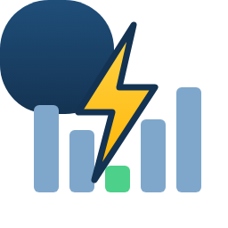
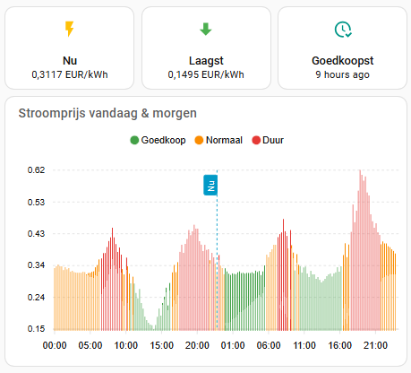

# Jeroen.nl energieprijzen voor Home Assistant

Leest de dynamische stroomprijzen van [jeroen.nl](https://jeroen.nl) in Home Assistant in: vandaag en (vanaf ca. 13:00) morgen, per kwartier.

## Installatie via HACS

1. HACS → ⋮ → **Aangepaste repositories**
2. URL: `https://github.com/JorisBr-NL/HomeAssistant-energieprijzen.git`, type **Integratie**
3. Zoek **Jeroen.nl energieprijzen**, installeer en herstart Home Assistant
4. **Instellingen → Apparaten en diensten → Integratie toevoegen → Jeroen.nl energieprijzen**
5. Vul je API-sleutel in (het deel na `key=` in je API-URL)

## Sensoren

| Sensor | Uitleg |
|---|---|
| Huidige prijs | Prijs voor het huidige kwartier (all-in, zie opties) |
| Huidige prijs excl. belastingen | Kale prijs van jeroen.nl |
| Volgende prijs | Prijs voor het volgende kwartier |
| Laagste / hoogste / gemiddelde prijs vandaag | Met `start`/`end` als attribuut bij laagste/hoogste |
| Laagste / gemiddelde prijs morgen | Leeg tot de prijzen van morgen bekend zijn |
| Goedkoopste moment vandaag / morgen | Tijdstempel van het goedkoopste kwartier (attributen `end` en `price`), direct bruikbaar als tijd-trigger |

De sensor **Huidige prijs** heeft de attributen `prices_today`, `prices_tomorrow` (lijst met `start`, `end`, `price`) en `tomorrow_available`. Die zijn bruikbaar in bijvoorbeeld ApexCharts of automations. Ze worden niet in de database opgeslagen.

## All-in prijs

Via **Configureren** op de integratie stel je in:

- opslag/inkoopvergoeding leverancier (EUR/kWh, excl. btw)
- energiebelasting (EUR/kWh, excl. btw)
- btw (%)

Berekening: `(kale prijs + opslag + energiebelasting) × (1 + btw/100)`. Standaardwaarden: opslag € 0,016 (gemiddelde van Zonneplan, ANWB Energie en Frank Energie, excl. btw), energiebelasting € 0,09161 (2026, excl. btw) en btw 21%. Zet alles op 0 voor alleen de kale prijs. Let op: de energiebelasting verandert elk jaar per 1 januari.

## API-gebruik

De prijzen worden gecached. De API wordt alleen aangeroepen als de prijzen van vandaag of morgen nog ontbreken (controle elke 30 minuten). De sensorwaarden wisselen elk kwartier zonder extra API-aanroep.

## Voorbeeld: automation op het goedkoopste moment

```yaml
triggers:
  - trigger: time
    at: sensor.jeroen_nl_energieprijzen_goedkoopste_moment_vandaag
actions:
  - action: switch.turn_on
    target:
      entity_id: switch.vaatwasser
```

## Voorbeeld: dashboardkaart



Drie tegels met de huidige prijs, de laagste prijs en het goedkoopste moment, met daaronder een grafiek van vandaag en morgen. Elk kwartier krijgt een kleur ten opzichte van het daggemiddelde: groen is meer dan 10% goedkoper, rood meer dan 10% duurder, oranje daartussen.

Vereist: [apexcharts-card](https://github.com/RomRider/apexcharts-card) (HACS → Frontend). Controleer de entity-ID's bij jou via **Instellingen → Entiteiten**.

```yaml
type: vertical-stack
cards:
  - type: grid
    columns: 3
    square: false
    cards:
      - type: tile
        entity: sensor.jeroen_nl_energieprijzen_huidige_prijs
        name: Nu
        icon: mdi:flash
        color: amber
        vertical: true
      - type: tile
        entity: sensor.jeroen_nl_energieprijzen_laagste_prijs_vandaag
        name: Laagst
        icon: mdi:arrow-down-bold
        color: green
        vertical: true
      - type: tile
        entity: sensor.jeroen_nl_energieprijzen_goedkoopste_moment_vandaag
        name: Goedkoopst
        icon: mdi:clock-check-outline
        color: teal
        vertical: true

  - type: custom:apexcharts-card
    graph_span: 48h
    span:
      start: day
    now:
      show: true
      label: Nu
    header:
      show: true
      title: Stroomprijs vandaag & morgen
    all_series_config:
      type: column
      unit: €/kWh
      float_precision: 3
      show:
        in_header: false
        legend_value: false
    yaxis:
      - decimals: 2
        apex_config:
          tickAmount: 5
    apex_config:
      chart:
        stacked: true
        height: 280
      plotOptions:
        bar:
          columnWidth: "95%"
      dataLabels:
        enabled: false
      legend:
        show: true
        position: top
      grid:
        strokeDashArray: 3
      xaxis:
        labels:
          datetimeFormatter:
            hour: "HH:mm"
      tooltip:
        shared: false
        x:
          format: "dd MMM HH:mm"
    series:
      - entity: sensor.jeroen_nl_energieprijzen_huidige_prijs
        name: Goedkoop
        color: "#43a047"
        data_generator: |
          const all = [...(entity.attributes.prices_today || []), ...(entity.attributes.prices_tomorrow || [])];
          const day = p => p.start.slice(0, 10);
          const avg = {};
          for (const d of new Set(all.map(day))) {
            const xs = all.filter(p => day(p) === d).map(p => p.price);
            avg[d] = xs.reduce((a, b) => a + b, 0) / xs.length;
          }
          return all.map(p => [new Date(p.start).getTime(),
            p.price < avg[day(p)] * 0.9 ? p.price : null]);
      - entity: sensor.jeroen_nl_energieprijzen_huidige_prijs
        name: Normaal
        color: "#fb8c00"
        data_generator: |
          const all = [...(entity.attributes.prices_today || []), ...(entity.attributes.prices_tomorrow || [])];
          const day = p => p.start.slice(0, 10);
          const avg = {};
          for (const d of new Set(all.map(day))) {
            const xs = all.filter(p => day(p) === d).map(p => p.price);
            avg[d] = xs.reduce((a, b) => a + b, 0) / xs.length;
          }
          return all.map(p => [new Date(p.start).getTime(),
            p.price >= avg[day(p)] * 0.9 && p.price <= avg[day(p)] * 1.1 ? p.price : null]);
      - entity: sensor.jeroen_nl_energieprijzen_huidige_prijs
        name: Duur
        color: "#e53935"
        data_generator: |
          const all = [...(entity.attributes.prices_today || []), ...(entity.attributes.prices_tomorrow || [])];
          const day = p => p.start.slice(0, 10);
          const avg = {};
          for (const d of new Set(all.map(day))) {
            const xs = all.filter(p => day(p) === d).map(p => p.price);
            avg[d] = xs.reduce((a, b) => a + b, 0) / xs.length;
          }
          return all.map(p => [new Date(p.start).getTime(),
            p.price > avg[day(p)] * 1.1 ? p.price : null]);
```

Pas `0.9` en `1.1` aan om de grenzen voor goedkoop en duur te verschuiven, en `graph_span: 24h` om alleen vandaag te tonen.

## Icoon

Het icoon in `brand/` is een eigen ontwerp voor deze integratie. Het is geen logo van jeroen.nl, en deze integratie is niet officieel van of verbonden aan jeroen.nl.
